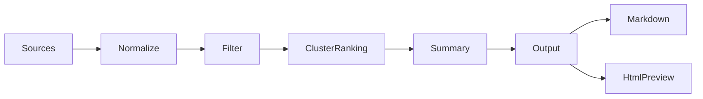

# 系統架構圖

```mermaid
flowchart LR
  Sources --> Normalize --> Filter --> ClusterRanking --> Summary --> Output
  Output --> Markdown
  Output --> HtmlPreview
```

`domain` 保留商業模型與介面；`sources` 是可插拔 adapter；`analyzer` 不直接了解網路；`output` 不直接抓來源。此分層維持低耦合並可於後續 Sprint 新增 LINE、Notion 或 Email renderer。
