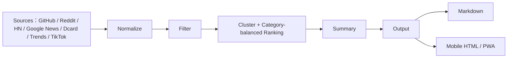

# 系統架構圖

`domain` 保留商業模型與介面；`sources` 是可插拔 adapter；`analyzer` 不直接了解網路；`output` 不直接抓來源。此分層維持低耦合並可於後續 Sprint 新增 LINE、Notion 或 Email renderer。

0.9.11 起，Ranking 採「每個分類最多 3 則」的平衡策略，並用相似標題合併降低洗版。生活流行由 Dcard 公開熱門貼文與小紅書相關公開搜尋/新聞訊號補足；小紅書不做登入式抓取，避免不穩定與可信度風險。
