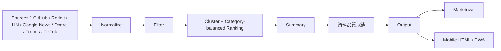
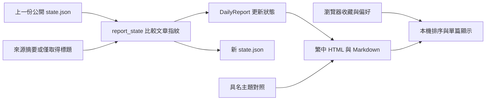
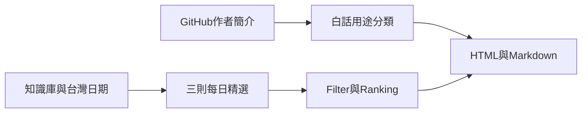

# 系統架構圖

## 呈現層規則（0.9.18）

`HtmlPreviewRenderer` 依情報性質挑選元件，而不是一律使用新聞卡：最重要一則為 Hero、突發在地消息為 Alert、搜尋與社群訊號為 Ranking，並固定保留使用者關注頻道的 Compact List。圖片僅由可用來源安全推導時產生：目前僅使用 YouTube 官方縮圖；其他來源維持文字資訊，避免錯圖、載入失敗與侵權風險。`filter_items` 會清除 RSS HTML，並略過未翻譯的英文 Reddit／Hacker News 貼文，避免它們進入繁中首頁。

```mermaid
flowchart LR
  Sources["Sources：GitHub / Reddit / HN / Google News / Dcard / Trends / TikTok"] --> Normalize
  Normalize --> Filter
  Filter --> ClusterRanking["Cluster + Category-balanced Ranking"]
  ClusterRanking --> Summary
  Summary --> HealthCheck["資料品質狀態"]
  HealthCheck --> Output
  Output --> Markdown
  Output --> HtmlPreview["Mobile HTML / PWA"]
```

`domain` 保留商業模型與介面；`sources` 是可插拔 adapter；`analyzer` 不直接了解網路；`output` 不直接抓來源。此分層維持低耦合並可於後續 Sprint 新增 LINE、Notion 或 Email renderer。

## 0.9.24 比較與偏好

```mermaid
flowchart LR
  Previous[上一份公開 state.json] --> Compare[report_state 比較文章指紋]
  Summary[來源摘要或僅取得標題] --> Compare
  Compare --> Report[DailyReport 更新狀態]
  Report --> HTML[繁中 HTML 與 Markdown]
  Compare --> Next[新 state.json]
  Topics[具名主題對照] --> HTML
  Local[瀏覽器收藏與偏好] --> Order[本機排序與單篇顯示]
  HTML --> Order
```

無新增資料庫或 HTTP API；狀態檔由入口層讀寫，來源仍獨立。偏好不傳至 GitHub Actions，不影響雲端採集；收藏與主題排序由獨立 `feedback.js` 處理。

0.9.11 起，Ranking 採「每個分類最多 3 則」的平衡策略，並用相似標題合併降低洗版。生活流行由 Dcard 公開熱門貼文與小紅書相關公開搜尋/新聞訊號補足；小紅書不做登入式抓取，避免不穩定與可信度風險。

0.9.13 起，`DailyReport` 會根據實際成功來源數和來源錯誤計算資料品質狀態。HTML 與 Markdown 都讀取同一個狀態，確保只有少量來源或有平台被擋時不會誤顯示為正常連線。

## 0.9.25｜GitHub 使用指南與冷知識（2026-10-07）

新增 KnowledgeSource（離線人工整理、一手出處）與 github_guide（純函式、無網路、依作者簡介分類）。來源保存 repo_description，呈現層選用專用指南；原新聞資料流不變。

```mermaid
flowchart LR
  GitHub作者簡介 --> RepositoryGuide[白話用途分類]
  RepositoryGuide --> HTML與Markdown
  知識庫與台灣日期 --> KnowledgeSource[三則每日精選]
  KnowledgeSource --> Filter與Ranking
  Filter與Ranking --> HTML與Markdown
```

未知用途保留明確提示，沒有假圖；離線知識不計入即時來源數。

限制：GitHub 使用例子是用途分類說明，非全文翻譯、實測或免費使用保證；冷知識目前六則每日輪替三則，非即時新聞。未引入資料庫、登入或付費服務。
